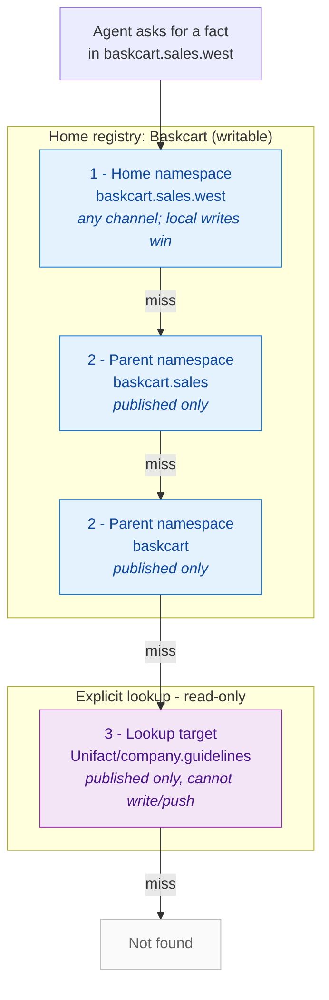

# UniFact

**One Fact. One Truth.**

Source control for organizational facts — one governed truth **per organization**.

## Mental model

| Git | UniFact |
|-----|---------|
| Host / org | Host (`staging.unifact.ai`) + **registry** (e.g. `Unifact`, `Baskcart`) |
| `git init` | `uni init Unifact` — you become owner |
| Join + access | `uni join` → owner `uni approve` / `uni suspend` |
| `pull` / `push` | `uni pull` / `uni push` (home registry only) |
| Branches / PRs | Channels: proposed → review / feedback → **published** |
| Folders in repo | **Namespaces** (dotted hierarchy, e.g. `company.constraints`) |

**Registry** = tenancy / membership / who may write.  
**Namespace** = topic folder inside a registry. Names must not collide (a name cannot be both).

### When to create which

| Create a **registry** when… | Create a **namespace** when… |
|-----------------------------|------------------------------|
| Separate join/approve boundary | Same members group topics |
| Separate write/push tenancy | Dotted hierarchy is enough (`sales.policy`) |

### Lookup & org-public

- **Parent namespaces** are implicit (`sales.west` → `sales`).
- **Lookup** is an explicit read path: `uni lookup add <from-ns> <target>` (published, read-only).
- **Org-public** is set per **namespace** (`uni public company.guidelines`): any registry on the host may discover it and look up its published facts — not internet-public. Descendant namespaces are included.
- Discover: `uni discover`. Example: `uni lookup add my.area Unifact/company.guidelines`.
- Coarse option: `uni public --registry` exposes **every** published fact in the registry; prefer per-namespace so internal namespaces (e.g. `company.infrastructure`) stay private.

The seeded **Unifact** registry publishes `company.guidelines` and `company.branding` as org-public so agents on other registries can follow the same basics (registry vs namespace, membership, lookup). Its `company.decisions`, `company.constraints`, and `company.infrastructure` namespaces stay private.

Each registry’s private facts stay private. You only **write** registries you belong to.

### How lookup & inheritance resolve

When an agent asks for a fact from a namespace, UniFact resolves it in three ordered steps — the **home namespace** (any channel), then **parent namespaces** up the dotted hierarchy (published only), then any **explicit lookups** (published, read-only). The first hit wins.



- **Parent namespaces** are *implicit* — no registration, just the dotted name (`a.b.c` → `a.b` → `a`).
- **Lookups** are *explicit and cross-registry* — added with `uni lookup add`, gated by org-public visibility or membership, and never grant write/push.
- Only **published** facts are visible via parent/lookup; your own namespace sees every channel.

## Quick start

```bash
git clone https://github.com/baskcart/unifact.git
cd unifact
npm install
npm run build
npm link          # installs `uni` on your PATH
npm run seed      # optional sample facts
npm run dev       # API on :4110
```

```bash
uni use admin
uni init Unifact

uni use alice
uni join Unifact

uni use admin
uni approve Unifact alice

uni add "Returns are free within 30 days"
uni facts
uni publish policy/return_window
uni push
uni pull

# Platform guidelines (org-public Unifact)
uni discover
uni lookup add policy Unifact/company.guidelines
```

Plain-language guide: [`docs/user-guide.html`](docs/user-guide.html)

## Everyday CLI

```text
uni use <person> | whoami
uni status
uni facts [Registry]
uni team [Registry]
uni init <Registry> | join <Registry> | approve | suspend
uni public <namespace> | public off <namespace> | public --registry | discover
uni lookup | lookup add <from> <target> | lookup remove …
uni add "<value>"
uni extract <file.md> [--dry-run]   # → proposed only
uni publish <namespace/key> | feedback <namespace/key>
uni audit [--format json|csv]
uni pull | push [ns | ns/key | pattern*]
```

Enterprise readiness (tenancy, audit, checklist): [`docs/enterprise-readiness.md`](docs/enterprise-readiness.md)

## Work Agents & MCP

**Work agents** (Cursor, Codex, Claude, Devin, Antigravity, Cowork, and similar) should treat **UniFact MCP** as the shared org-truth interface — not README-first exploration.

Deep setup / troubleshooting: [`docs/mcp.md`](docs/mcp.md) · example config: [`.cursor/mcp.json.example`](.cursor/mcp.json.example)

### Integrate (any MCP host)

1. Clone this repo and `npm install`. Rebuild native modules if needed: `npm rebuild better-sqlite3` (must match the **same Node major** the MCP process uses).
2. Create or approve a person for the agent (`uni use cursorAgent`, join/approve on your org registry).
3. Add a stdio MCP server to your host (Cursor `~/.cursor/mcp.json`, Claude Desktop, Codex, etc.):

```json
{
  "mcpServers": {
    "unifact": {
      "command": "C:/Program Files/nodejs/node.exe",
      "args": [
        "C:/PATH/TO/unifact/node_modules/tsx/dist/cli.mjs",
        "C:/PATH/TO/unifact/src/mcp.ts"
      ],
      "env": {
        "DATABASE_PATH": "C:/PATH/TO/unifact/store.db"
      }
    }
  }
}
```

Use **absolute paths**. Point `command` at the system Node that matches `better-sqlite3` (IDE-bundled Node often breaks native modules).

4. Fact Check before work that depends on org truth: `sync_pull`, then `search_facts` / `list_facts` / `find_relevant_facts`.
5. Propose with `propose_fact` / `upsert_fact`. Publish only through your org’s review rules (`publish_fact` / CLI `uni publish`).

### All MCP tools

| Area | Tools |
|------|--------|
| Sync | `sync_pull`, `sync_push`, `sync_status` |
| Read | `list_facts`, `get_fact`, `search_facts`, `find_relevant_facts`, `list_namespaces`, `registry_metadata`, `pull_facts_for_agent` |
| Write / lifecycle | `propose_fact`, `upsert_fact`, `publish_fact`, `feedback_fact`, `approve_fact`, `reject_fact`, `review_fact`, `supersede_fact`, `retract_fact`, `delete_fact`, `list_review_queue`, `list_fact_versions` |
| Audit | `audit_fact`, `export_audit_log` |
| Extract | `extract_facts_from_document` |
| Agent profiles | `list_agent_profiles`, `get_agent_profile`, `upsert_agent_profile`, `delete_agent_profile` |

Product site: [unifact.ai/#work-agents](https://www.unifact.ai/#work-agents)

## Framework discovery

Any HTTP client can probe a UniFact host (no API key):

```bash
curl -s https://staging.unifact.ai/.well-known/unifact.json
# or  GET /v1/discovery
```

| Doc | Purpose |
|-----|---------|
| [`docs/frameworks.md`](docs/frameworks.md) | MCP / HTTP / what not to PR upstream |
| [`docs/config-as-facts.md`](docs/config-as-facts.md) | Secrets in env; config in facts |
| [`examples/authjs-config-from-facts.ts`](examples/authjs-config-from-facts.ts) | Auth.js-style loader (app-side, not an Auth.js PR) |

**Work agents** → MCP. **Web apps** → bootstrap URL + key, then Fact Check `company.infrastructure/*`.

## Shared host

1. Point at the host (upstream URL fact, or your team’s usual setup).
2. Join the org; owner approves and shares the printed key if needed.
3. Use the **same** person key locally and on the host, then `uni pull` / `uni push`.

- **pull** — published facts only  
- **push** — send proposed / review / feedback / published (not an automatic publish)

## Deploy

See **[docs/deploy.md](docs/deploy.md)** for running a host (Node or Docker, SQLite or PostgreSQL).

## Related

| | |
|--|--|
| [unifact.ai](https://unifact.ai) | Product site |
| [User guide](docs/user-guide.html) | Onboarding for everyone |
| [MCP for work agents](docs/mcp.md) | Integrate Cursor, Claude, Codex, … |
| [Frameworks](docs/frameworks.md) | Discovery, adapters, Auth.js note |
| [Config as facts](docs/config-as-facts.md) | Env secrets vs infrastructure facts |
| This repo | Registry engine (API, MCP, CLI) |

AI shouldn't remember everything. It should know where to find the truth.
